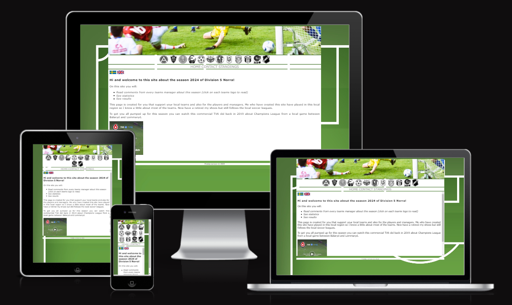
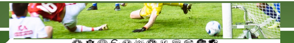
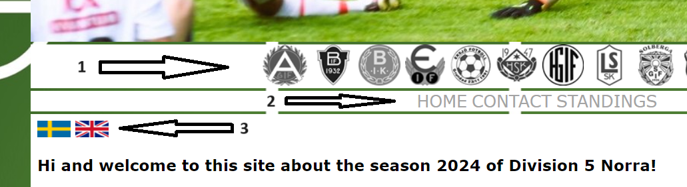
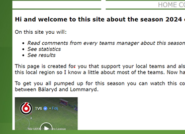
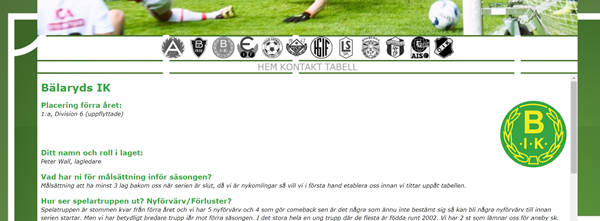
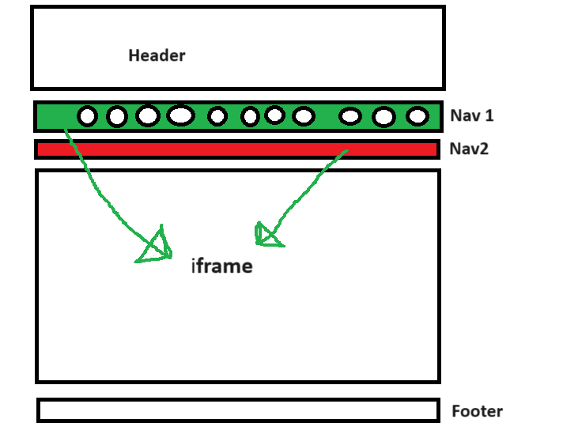
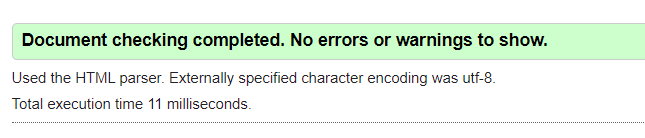
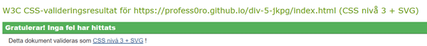

# Division 5 Norra

### This is a website I´ve made focusing on the pre-season for a local soccer league in the area of Jönköping.

### I have created this website mainly for people that loves soccer around this area. So that supporters/players/managers can have a insight what the team managers thoughts are about this season. 

### When reading the managers answer of my questions the supporters have more information about what the teams think of this season.

# Features 

- <b>Team info:</b> on each teams page you can read every manager or teamleaders thoughts about the season of year 2024. 
- <b>Rescent scores:</b> See each teams rescent scores and follow a link to a game summary of each specific game.
- <b>Standings:</b> There is a link to the association so the user can see the standings for this season.

# User value

The users will be provided first hand information from the managers/teamleaders thoughts about the season of year 2024.

# Contents

### Header

This is a picture from a local game that a local paper put in an article.

### Navigation

1. Here I´ve put a navigation to all the teams info in a seperated navigation bar. 
2. Here is a smaller navigation bar to pages outside the teams information.
3. On the homepage you can decide if you want to visit the page in swedish or english. 

### Home

Here is an introduction to what you can expect to find on this website to all visitors. Also an old commercial the swedish channel "TV6" did for Champions League at a local game.

### Team pages

On every teams page the color on the text changes to the color that mainly is in their logo. 
Here you can read the answers that the managers has been provided and links to rescent game summaries.

### Contact

Here is information how to contact me if there´s more content that the visitors want to see.

# Structure

As you can see in this picture all links to team pages at nav1 is targeting the iframe, thats a method I´ve learned years ago and doesn´t need to load a whole new url every time you click on a link. The exceptions is "standings" at nav2 (opens in a new window/tab) and changing language at the home page (opens on top).

# Problems I encountered

- my biggest issue with this structure that I´ve chosen was to not have any scrollbar at the page at any type of screen. That was solved by having a height at the iframe of vh60%, so that the only scrollbar visual is in the iframe where all info is shown.
- a smaller problem was the navigation with all the the logos so they won´t change any size on any screensize, they just create more rows on the screen. First I thought that would be a problem on mobile phones, but when I looked at the page in my phone that didn´t disturb anything and was easier to navigate when they didn´t change size. If the logos had been smaller on smaller screens it would have been harder to navigate to all team pages.

 # Design

 - background picture is a soccerfield that gets more visual the bigger your screen are. The image is downloaded from https://www.vecteezy.com/free-vector/soccer-pitch

 - Font is Verdana which is a clean easyreadable font that doesn´t require downloading of a new font for the user.

 - Team logos are aquired from https://www.smalandsfotbollen.se/

 - Color of the text on the teampage are aquired from the color of the logo, except IF Eksjö Fotboll´s page, that text color are from their jerseys. Used Paint´s tool "Color picker"

 - The header picture are from https://tranastidning.se/

 - Favicon downloaded from https://favicon.io/emoji-favicons/soccer-ball/

# What I would like to implement:

- <b>A guestbook</b> - where visitors/supporters could comment games and other happenings in the league.
- <b>Post-season comments</b> - here could supporters read comments from the manager about the season when it has ended.

# Testing

<b>HTML</b> - Went through without fails ( https://validator.w3.org )

<b>CSS</b> - Went through without fails ( https://jigsaw.w3.org/css-validator )

<b>Responsiveness</b> - Checked with Chromes built in (right-click -> inspect) and also manually on laptop/smartphone/big screen.

<b>public testing</b> - Sent out the live page to group of people that this webpage mainly aims to when I got the answers from the managers. The response was very good from visitors, that found it easy to navigate through the webpage.

# Deployment

This website is built in Visual Studio Code and published to GitHub using commands as: git add ____ / git commit -m "message" / git push

# Source reference

- https://tranastidning.se/ - header picture.
- https://smalandsfotbollen.se/ - team logos, rescent scores and last years placements.
- https://validator.w3.org/ - testing HTML
- https://jigsaw.w3.org/css-validator/ testing CSS
- https://www.vecteezy.com/free-vector/soccer-pitch - background picture
- absorbed some codes through Code Institutes challenges but most of the codes used are from knowledge before (selflearned with https://javascript.nu/ years back)
- https://www.w3schools.com/ for a searching after css attributes.
- Mail and text messages with the managers is how I´ve got the information for the teams pages.
- https://favicon.io/emoji-favicons/soccer-ball/ - Favicon

# Mentions

- [Jörgen Jonsson](https://app.slack.com/client/T0L30B202/D06QHCBJF5X) & [Erik Guldbrand](https://app.slack.com/client/T0L30B202/D06Q3PZC22V) who welcomed and helped me with git commands and how to think in the beginning.
- [Mark Nevison](https://app.slack.com/client/T0L30B202/D06QN5856BH) for reviewing this project and guiding me to fix some issues.

