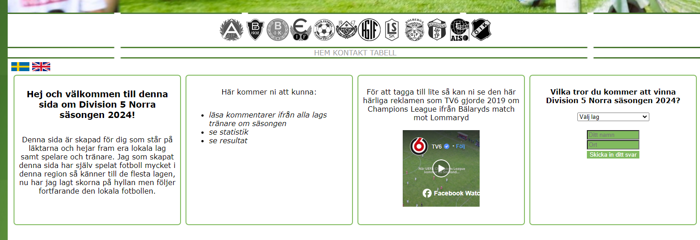

# Division 5 Norra

### This is a website I´ve made focusing on the pre-season for a local soccer league in the area of Jönköping.

#### I have created this website mainly for people that loves soccer around this area. So that supporters/players/managers can have a insight what the team managers thoughts are about this season. 

#### When reading the managers answer of my questions the supporters have more information about what the teams think of this season.

## User Stories

- <b>Landing page:</b> As a visiting user I´m first landing at a swedish version and have a choice at the top left corner to change to the english version. While I´m going further on this page there is general info about what I can find on the website, a TV-commercial that I can watch. Last there is a form where I´m guessing the team that will win this season.
 

- <b>Contact page:</b> As a visiting user I´ll find a link to mail the the author if there´s something missing on the website.

- <b>Standings:</b> As a visiting user and clicking on this link another tab opens up to soccer associations official site where I can see the actual standings in the league.

- <b>Team pages:</b> As a visiting user and clicking on a teams logo (teamname on smaller screens navbar) the chosen teams info will be shown for me in the main content area and here I can read the last years position, commentaries from the managers about this season and if I click on the rescent games score there´s a new tab opening with the official summary of that specific game.

# Features 

<b>Navigation for screens wider than 768px:</b>  

1. Here I´ve put a navigation to all the teams info in a seperated navigation bar. All logos are in a greyscale and if you hover on a logo that will be in color (except the logos that are only black and white). If you click on a teams logo their info will be shown in the iframe below the navigation.
2. I´ve seperated the teams navigation with the links to pages that doesn´t concern info about the teams in a smaller navigation below the logos. Here the text is grey and if you hover over the text it will be green and bolder.

#### Navigation on smaller screens: 
- When you click on the bars icon this menu will be shown. Here I´ve seperated the teampages and other pages with seperated fontstyles. Green color and lowercase for the teams pages and grey color and uppercase for the pages that doesn´t concern the teams.

#### Teampages: 

- on each teams page you can read every manager or teamleaders thoughts about the season of year 2024. 
- Rescent scores: See each teams rescent scores and follow a link to a game summary of each specific game.

### Home

On the homepage can you: 
- read general info about this website
- watch an old TV-commercial a swedish TV-channel did from a local game for Champions League.
- Answer a form where you guess who will win this season, the form requires both fields filled.

### Team pages

On every teams page can you read the answers that I´ve got from the managers about this season. There are also links to rescent game summaries.

### Contact

Here is information how to contact me if there´s more content that the visitors want to see.

# User value

The users will be provided first hand information from the managers/teamleaders thoughts about the season of year 2024.

# Contents

### Header

This is a picture from a local game that a local paper put in an article.

### Navigation

# Structure

As you can see in this picture all links to team pages at nav1 is targeting the iframe, thats a method I´ve learned years ago and doesn´t need to load a whole new url every time you click on a link. The exceptions is "standings" at nav2 (opens in a new window/tab) and changing language at the home page (opens on top).

# Bugs I encountered

- Since there was so much info to show on the teampages a scrollbar showed up on the side. But I wanted a smoother version of the website. My solution to this was to put in an iframe between the navbars and the footer. this made that all stayed in place and only the iframe was scrollable.
- 

 # Design

 - background picture is a soccerfield that gets more visual the bigger your screen are. The image is downloaded from https://www.vecteezy.com/free-vector/soccer-pitch

 - Font is Verdana which is a clean easyreadable font that doesn´t require downloading of a new font for the user.

 - Team logos are aquired from https://www.smalandsfotbollen.se/

 - Color of the text on the teampage are aquired from the color of the logo, except IF Eksjö Fotboll´s page, that text color are from their jerseys. Used Paint´s tool "Color picker"

 - The header picture are from https://tranastidning.se/

 - Favicon downloaded from https://favicon.io/emoji-favicons/soccer-ball/

# What I would like to implement:

- <b>A guestbook</b> - where visitors/supporters could comment games and other happenings in the league.
- <b>Post-season comments</b> - here could supporters read comments from the manager about the season when it has ended.

# Testing

<b>HTML</b> - Went through without fails ( https://validator.w3.org )

<b>CSS</b> - Went through without fails ( https://jigsaw.w3.org/css-validator )

<b>Responsiveness</b> - Checked with Chromes built in DevTools (when on the page: right-click -> inspect)
Here I´ve tested on:
- Galaxy Fold 
- Iphone 14 Pro Max
- Ipad Mini
- Surface Pro 7
 and all looked easy to navigate at. 

<b>Manually tested on:</b>
- Samsung Galaxy S23 Ultra (my own phone)
- Laptop with dimensions 1024x768
- Screen with dimensions 1920x1080
 also here it was easy to navigate.

<b>public testing</b> - Sent out the live page to group of people that this webpage mainly aims to when I got the answers from the managers. The response was very good from visitors, that found it easy to navigate through the webpage.

# Deployment

# Source reference
- https://www.cleancss.com/css-beautify/ - formatting CSS files
- https://www.freeformatter.com/html-formatter.html - Formatting HTML files
- https://www.youtube.com/watch?v=oLgtucwjVII - This tutorial guided me to create a navbar for smallest screens
- https://tranastidning.se/ - header picture.
- https://smalandsfotbollen.se/ - team logos, rescent scores and last years placements.
- https://validator.w3.org/ - testing HTML
- https://jigsaw.w3.org/css-validator/ testing CSS
- https://www.vecteezy.com/free-vector/soccer-pitch - background picture
- absorbed some codes through [Code Institutes](https://codeinstitute.net/) challenges but most of the codes used are from knowledge before (selflearned with https://javascript.nu/ years back)
- https://www.w3schools.com/ for a searching after css attributes.
- Mail and text messages with the managers is how I´ve got the information for the teams pages.
- https://favicon.io/emoji-favicons/soccer-ball/ - Favicon
- https://ui.dev/amiresponsive - Responsive picture

# Mentions
- [Rohit Sharma](https://app.slack.com/client/T0L30B202/D06Q6HHFBE0) - My mentor, who guided me well to fix issues.
- [Jörgen Jonsson](https://app.slack.com/client/T0L30B202/D06QHCBJF5X) & [Erik Guldbrand](https://app.slack.com/client/T0L30B202/D06Q3PZC22V) who welcomed and helped me with git commands and how to think in the beginning.
- [Mark Nevison](https://app.slack.com/client/T0L30B202/D06QN5856BH) for reviewing this project and guiding me to fix some issues.
- [Dajana Isbaner](https://code-institute-room.slack.com/team/U060C7Q4W8L) for reviewing and helping me with margins!

