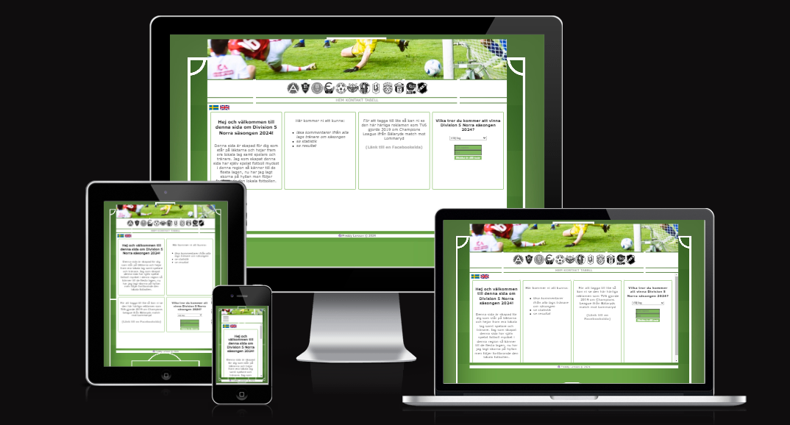
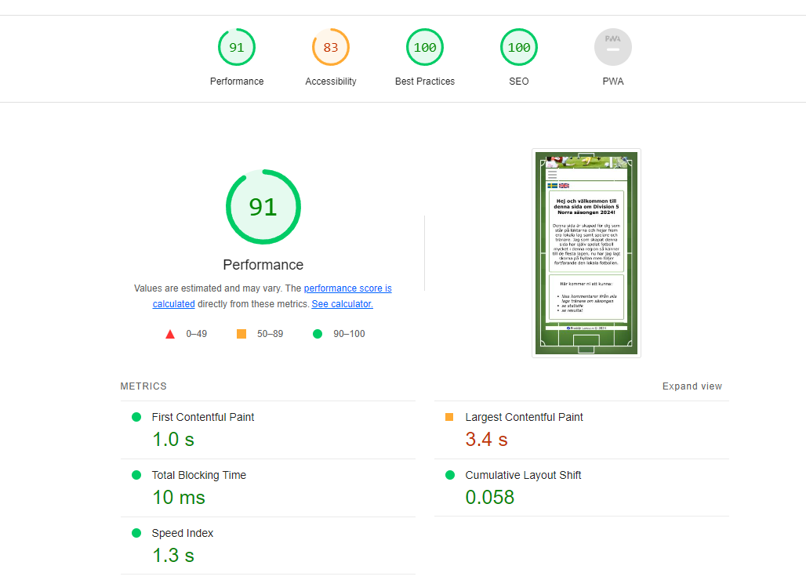
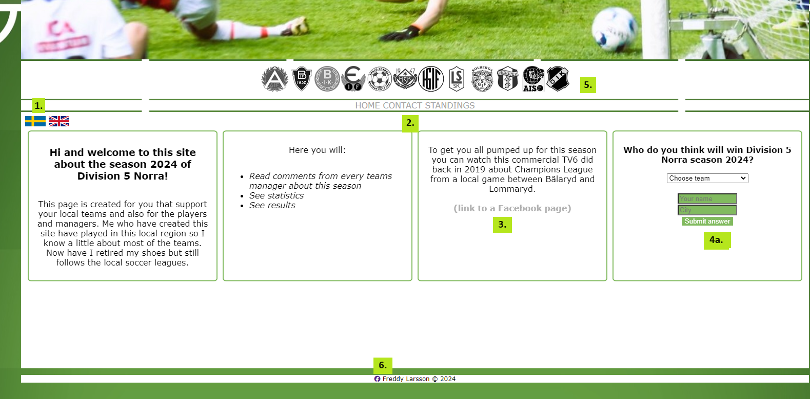
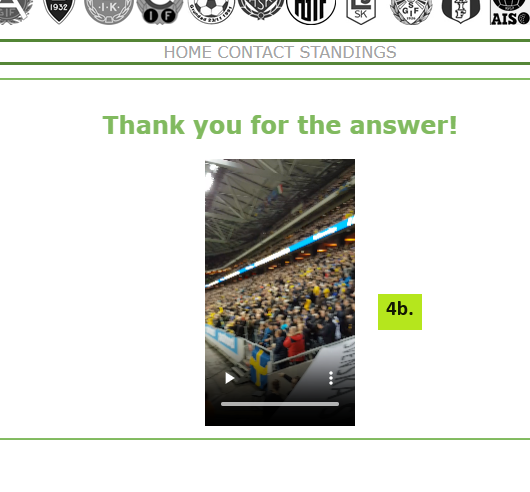
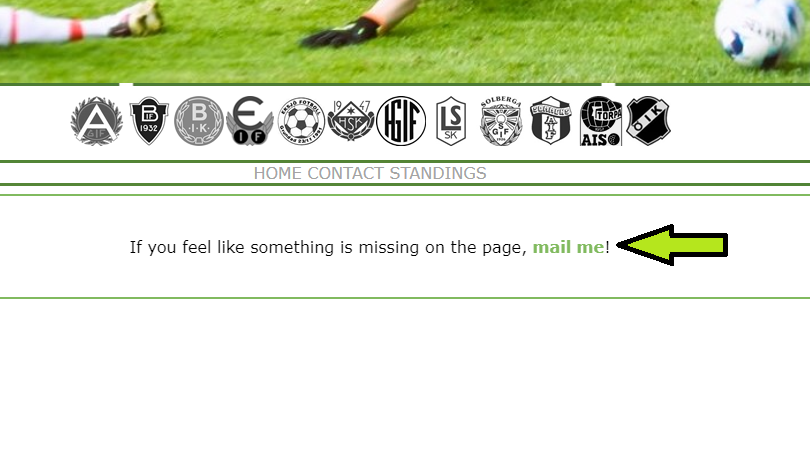
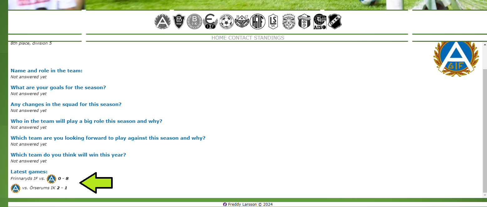
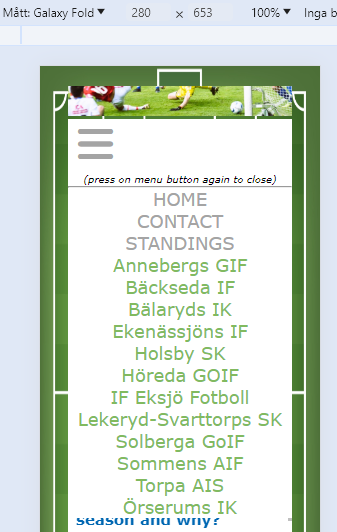
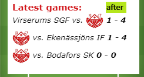

# Division 5 Norra

### This is a website I´ve made focusing on the pre-season for a local soccer league in the area of Jönköping.

#### I have created this website mainly for people that loves soccer around this area. So that supporters/players/managers can have a insight what the team managers thoughts are about this season. 

#### When reading the managers answer of my questions the supporters have more information about what the teams think of this season.

## User Stories

- **Landing page:** As a visiting user I´m first landing at a swedish version and have a choice at the top left corner to change to the english version. While I´m going further on this page there is general info about what I can find on the website, a TV-commercial that I can watch. Last there is a form where I´m guessing the team that will win this season.
 

- **Contact page:** As a visiting user I´ll find a link to mail the the author if there´s something missing on the website.

- **Standings:** As a visiting user and clicking on this link another tab opens up to soccer associations official site where I can see the actual standings in the league.

- **Team pages:** As a visiting user and clicking on a teams logo (teamname on smaller screens navbar) the chosen teams info will be shown for me in the main content area and here I can read the last years position, commentaries from the managers about this season and if I click on the rescent games score there´s a new tab opening with the official summary of that specific game.

# Features 

### Navigation

**Navigation for screens wider than 768px:**

1. Here I´ve put a navigation to all the teams info in a seperated navigation bar. All logos are in a greyscale and if you hover on a logo that will be in color (except the logos that are only black and white). If you click on a teams logo their info will be shown in the iframe below the navigation.
2. I´ve seperated the teams navigation with the links to pages that doesn´t concern info about the teams in a smaller navigation below the logos. Here the text is grey and if you hover over the text it will be green and bolder.

**Navigation on smaller screens:**
- When you click on the bars icon this menu will be shown. Here I´ve seperated the teampages and other pages with seperated fontstyles. Green color and lowercase for the teams pages and grey color and uppercase for the pages that doesn´t concern the teams.  

### Home

- In the first square I´ve written down a small welcoming text for the visitor and who it targets. 
- In the second square there is information on what you can find on this website.
- In the third square can you watch an embedded TV-commersial from 2019 that TV6 did for Champions League from a local game.
- In the fourth square I did a form where you can guess which team will win this season. Both textfields are required to be filled. These squares have a flex code so they stack on eachother if you have smaller screens.

#### Teampages: 

- When you enter a teams page you will first find the teams position from last year.
- Underneith the last position can you find the answers from the questions that I´ve mailed out to all managers (not all have answered me).
- You can also see each teams rescent scores and follow a link to a game summary of each game.

### Contact

On this page there´s a link to mail me if a visitor finds something missing on the page.

### Standings

If you click on this link you will be directed to the associations official site with a live version of the leagues standings.

# Future features

- Something that I would like to add is a page similar to a guestbook where supporters can talk about this seasons games and other related things that happens during this season.
- A gallery where supporters can post pictures from games during the season.
- Commentaries from the managers after the season.

# Typography and color scheme

- On this site Verdana are used as font. This font I find easy to read so I chosed to not insert a font from e.g googlefonts

- Colors I´ve used beyond black (#000000) and white (#FFFFFF) are: 
    Green (#81BA5F) for links and broders and gray (#AFAFAF) for unhovered links and footer text. 
    
    

    On every teams page I have chosed to pick a color that are connected to every team, either by the color in their logo or shirtcolors. From left to right those colors are:

    #003499 | #0067B2 | #E31D1A | #36A544 | #D01014 | #9E293C | #154F99 | #C3170B | #000000

# Structure

As you can see in this picture all links to team pages at nav1 is targeting the iframe, thats a method I´ve learned years ago and doesn´t need to load a whole new url every time you click on a link. The exceptions is "standings" at nav2 (opens in a new window/tab) and changing language at the home page (opens on top).

# Technology

- **HTML and CSS**
- **Visual Studio Code** - This IDE was easy to use when coding this website.
- **Github** - For coding.
- **Github pages** - For deploying this site.
- **Fontawesome** - For adding navbar icon and facebook logo.

# Validation

**HTML** - Tested all 32 html-files seperatly with https://validator.w3.org, click<a href="https://profess0ro.github.io/div-5-jkpg/html-tests/index.html"> here </a>for results:

**CSS** - All 3 CSS-files went through W3C´s css balidation test without fails ( https://jigsaw.w3.org/css-validator )

**Lighthouse**

When tested on lighthouse the score lowers because of the large header picture. Header is large because it´s following the responsiveness of the screensize(whatever the size you´ve got on the screen).

 

# Testing
## Home Page

1. **Language selection**   - Expected: When Clicking the flag the website change language.  - Outcome: When Clicking each flag on both swedish and english page the language changes.
2. **Text menu**  - Expected: When Clicking home - start page shows. When Clicking contact - contact page shows. When Clicking standings - A new tab opens with the official standings. When you hover on this menu it will change color and be bold.  - Outcome: Clicking on home you are sent to the main page, when clicking on contact the contact page are shown and if you click on standings you are directed to a new tab with the official standings. Also the hovering effect shows when you drag the mouse over the menu. (works on both languages)
3. **Link to TV-commercial**  - Expected: When Clicking the hyperlink - A new tab opens with the TV-commercial. - Outcome: A new tab opens with the TV-commercial when clicking on the hyperlink. (works on both languages)
4. **Form** (4a and 4b) - Expected: When not typing anything or just one of the inputs (name/city) a message will be shown that the fields are required. When both fields are filled you will be directed to a page that thanks you and a video can be played. - Outcome: When not typing anything in the form or just a name or city, a message shows that it´s required to fill in the form. And if you fill in the form a page showes that you are thanked and a video can be played. (works on both languages)
5. **Logos menu**  - Expected: When hovering over the logos it will change from grayscale to color and when you click on each logo you will be directed to that teams page. - Outcome: All of the logos changes from grayscale to color when hovering over them. Also the links to each teams page are coming to the iframe when clicking on them. (works on both languages)
6. **Facebooklink in footer**  - Expected: When you click on the facebooklogo you are directed to my facebookpage in a new tab. - Outcome: When clicking on the facebook logo you are directed to my facebookpage in a new tab. (works on both languages)

## Contact page
 - Expected: Clicking on "mail me" will make you send a new email to me. - Outcome: When clicking on "mail me" an email window opens up with my email filled in the address field. (works on both languages)

## Team pages
 - Expected: All of the questions will be shown in each of the teams color and the hyperlinks to the latest games opens up in a new tab for the official game summary.  - Outcome: All of the teams pages shows the questions in the color I wanted and each teams latest games opens up in a new tab. (works on both languages)

## Navbar on mobilephones
 - Expected: When clicking on the links in this navbar the iframe will update with each page showing in the main content area. Also when clicking on standings it will be opened in a new tab. - Outcome: All of the links works as I wanted and the pages that the links direct to are shown in the main content area and the standings opens in a new tab. (works on both languages)

## Bugs I encountered during tests

- In the beginning I´ve tried to have the navigation with all the teams logos visible even on mobile phones. But those logos took to much space from the user to read the content, so the solution to that was to insert a togglebar for mobilephones so the content would be more visible for the visitor.

 
- Noticed that on Galaxy fold the part on teampages that shows latest scores didn´t look so good when I´ve typed the teams name. Solution to that was to insert the teams logo instead so it looked smoother on smaller screens. 

 

## Responsiveness 
- Checked with Google Chromes built in DevTools (when on the page: right-click -> inspect)

I have done DevTools test on the following models: - Galaxy Fold - Iphone 14 Pro Max - Ipad Mini - Surface Pro 7
 

**Manually tested responsiveness on:** - Samsung Galaxy S23 Ultra (my own phone) - Laptop with dimensions 1024x768 - Screen with dimensions 1920x1080

On all of these 7 tests i didn´t found anything hard to find or read.

(All of these tests above have been done with Google Chrome)

**Public testing** - Sent out the live page to group of people that this webpage mainly aims to. The response was very good from visitors, that found it easy to navigate through the webpage.

# Deployment

- **Visual Studio Code:**
1. Installed extension "GitHub Pull Requests".
2. Connected my Github account to Visual Studio.
3. Used command "Git:Clone" and pasted my repository address, now I´m connected to my repository.
4. "Git add ." | "Git commit -m" | "Git push" | Was commands used in Visual Studio to upload my files to my repository

- **Github:** 
1. Logged in to Github account.
2. Got to the repository for the site. 
3. Clicked on "settings" in the menu at the top. 
4. In settings, located "Pages" on the left-side navigation.
5. On the dropdown under "Source" selected "main" as branch and pressed save.

Live link: https://profess0ro.github.io/div-5-jkpg/

# Source reference
- https://www.cleancss.com/css-beautify/ - formatting CSS files
- https://www.freeformatter.com/html-formatter.html - Formatting HTML files
- https://www.youtube.com/watch?v=oLgtucwjVII - This tutorial guided me to create a navbar for smallest screens
- https://tranastidning.se/ - header picture.
- https://smalandsfotbollen.se/ - team logos, rescent scores and last years placements.
- https://validator.w3.org/ - testing HTML
- https://jigsaw.w3.org/css-validator/ testing CSS
- https://www.vecteezy.com/free-vector/soccer-pitch - background picture
- absorbed some codes through [Code Institutes](https://codeinstitute.net/) challenges but most of the codes used are from knowledge before (selflearned with https://javascript.nu/ years back)
- https://www.w3schools.com/ for a searching after css attributes.
- Mail and text messages with the managers is how I´ve got the information for the teams pages.
- https://favicon.io/emoji-favicons/soccer-ball/ - Favicon
- https://ui.dev/amiresponsive - Responsive picture
- The video on the formanswer page are filmed by myself on a soccergame.

# Mentions
- [Rohit Sharma](https://app.slack.com/client/T0L30B202/D06Q6HHFBE0) - My mentor, who guided me well to fix issues.
- [Jörgen Jonsson](https://app.slack.com/client/T0L30B202/D06QHCBJF5X) & [Erik Guldbrand](https://app.slack.com/client/T0L30B202/D06Q3PZC22V) who welcomed and helped me with git commands and how to think in the beginning.
- [Mark Nevison](https://app.slack.com/client/T0L30B202/D06QN5856BH) for reviewing this project and guiding me to fix some issues.
- [Dajana Isbaner](https://code-institute-room.slack.com/team/U060C7Q4W8L) for reviewing and helping me with margins!

